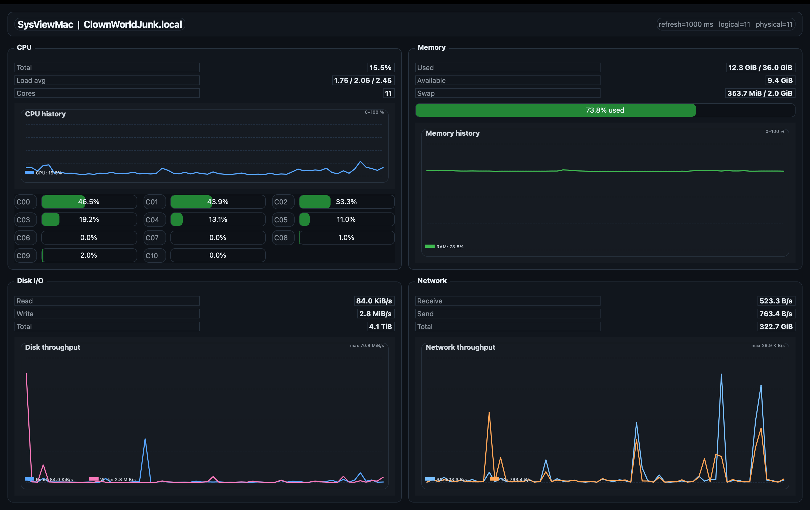

# SysView

Minimal, single-file PyQt5 system monitor for macOS.

`SysView` is the repository name for a lightweight, multi-platform system monitoring project.  
The current implementation is **SysViewMac** — a macOS desktop viewer built as a single-file PyQt5 application.



## Current implementation

**SysViewMac** provides a compact real-time view of:

- total CPU usage
- per-core CPU usage
- memory and swap usage
- disk read/write throughput
- network RX/TX throughput
- short rolling history graphs

The application is intentionally minimal and easy to extend.  
No backend, no database, no external service layer.

## Project goals

- single-file desktop utility
- rapid application development friendly
- easy local execution
- clean base for future multi-platform variants

## Requirements

- macOS
- Python 3
- PyQt5
- psutil

## Installation

Create a virtual environment and install dependencies:

```bash
python3 -m venv venv
source venv/bin/activate
pip install -r requirements.txt
```

## Run
```
python3 SysViewMac.py
```

## Files

	• SysViewMac.py — current macOS implementation
	• requirements.txt — Python dependencies
	• LICENSE — MIT license

## Roadmap

The repository is named SysView because the long-term direction is broader than macOS.
Future variants may include:
* Linux version
* Windows version
* shared cross-platform core
* optional richer visualizations
